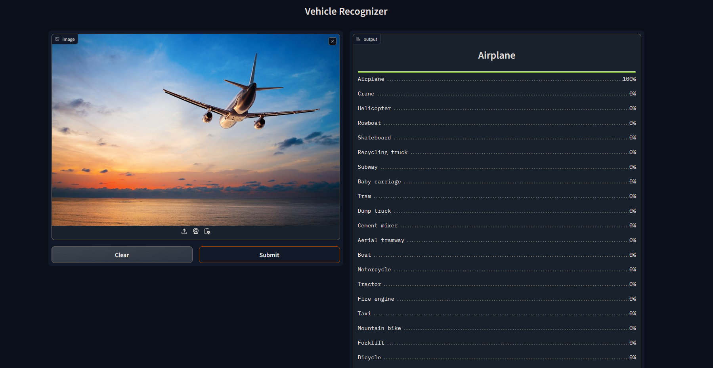

# Vehicle-Recognizer
The goal of this project is to classify 28 different types of vehicle commonly around the world.
The types are following:

1. Van
2. Taxi
3. Police car
4. Bus
5. Ambulance
6. Skateboard
7. Baby carriage
8. Bicycle
9. Mountain bike
10. Scooter
11. Motorcycle
12. Fire engine
13. Crane
14. Forklift
15. Tractor
16. Recycling truck
17. Cement mixer
18. Dump truck
19. Subway
20. Aerial tramway
21. Helicopter
22. Airplane
23. Balloon
24. Tram
25. Carriage
26. Rowboat
27. Boat
28. Train

# Dataset Preparation
**Data Collection:** Downloaded from DuckDuckGo using term name  
**DataLoader:** Used fastai DataBlock API to set up the DataLoader.  
**Data Augmentation:** fastai provides default data augmentation which operates in GPU.  

# Training and Data Cleaning
**Training:** Fine-tuned a resnet34 model for 5 epochs (3 times) and got upto ~98% accuracy.  
**Data Cleaning:** This part took the highest time. Since I collected data from browser, there were many noises. Also, there were images that contained. I cleaned and updated data using fastai ImageClassifierCleaner. I cleaned the data each time after training or finetuning, except for the last time which was the final iteration of the model.  

# Model Deployment
I deployed to model to HuggingFace Spaces Gradio App. The implementation can be found [here](https://huggingface.co/spaces/anistaluqdar/Vehicle-Recognizer).  

# API integration with GitHub Pages
The deployed model API is integrated [here](http://anistaluqdar.duckdns.org/Vehicle-Recognizer/) in GitHub Pages Website. 
